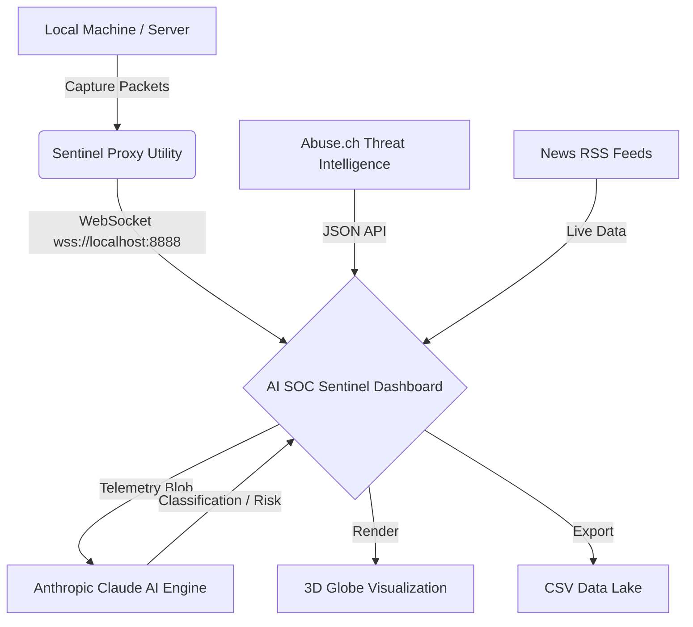

# 🛡️ AI SOC Sentinel

> **Professional Autonomous SIEM** — Real-time global threat detection, 3D satellite visualization, and hardware-to-web telemetry streaming powered by Anthropic Claude AI.

[](https://github.com/THAMARAISELVAM-A/ai-soc-sentinel/actions/workflows/deploy.yml)
[](https://react.dev)
[](https://vitejs.dev)
[](LICENSE)
[](SECURITY.md)

---

## 🌐 Live Demo & Deployment

**[→ Launch Command Center](https://thamaraiselvam-a.github.io/ai-soc-sentinel/)**

---

## 🚀 Key Features

### 📡 Zero-Manual-Task Sentinel Proxy
- **Hardware-to-Web**: Use the included `sentinel.py` to bridge your local machine telemetry directly to the dashboard.
- **Automated Uplink**: No copy-pasting required. The dashboard automatically detects your local sentinel via a steady WebSocket bridge on port `8888`.

### 🛡️ Enterprise-Grade AI Analysis
- **Live Threat Intelligence**: Integration with **Abuse.ch ThreatFox API** to ingest actual real-world IOCs as they happen.
- **Autonomous Forensic Engine**: Anthropic Claude classifies every telemetry log with high precision and MITRE ATT&CK mapping.

### 🌍 Elite 3D Global Monitoring
- **Satellite Constellation Tracking**: 28 satellites orbiting with real-time 3D physics and visual geometry models.
- **Reverse IP Geolocation**: 1-click "Tracing" zooms the globe directly to the coordinates of the attacker's city.

---

## 🏗️ Architecture: Hybrid Intelligence



---

## 🔧 Installation & Setup

### 1. Web Dashboard
```bash
git clone https://github.com/THAMARAISELVAM-A/ai-soc-sentinel.git
cd ai-soc-sentinel
npm install
npm run dev
```

### 2. Automated Sentinel Proxy (Local Machine)
```bash
# Install setup dependencies
pip install -r requirements.txt

# Start the bridge (Auto-detects dashboard)
python sentinel.py
```

---

## 📦 Project Structure

| Directory | Role |
|---|---|
---

## 📄 License

MIT © [THAMARAISELVAM-A](https://github.com/THAMARAISELVAM-A)
